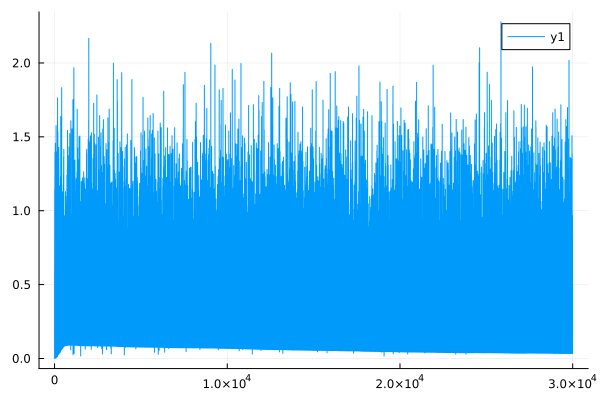

<center><h1>Shakespeare From Scratch</h1></center>

Training a transformer-decoder network, to produce shakespear-esque text, only using the Julia standard library (plus some extra packages for testing, which are only enabled in the CI run, and for GPU support).
I obtained my training data from [karpathy/char-rnn](https://github.com/karpathy/char-rnn/blob/master/data/tinyshakespeare/input.txt), who originally compiled the dataset.

## Running
```text
$ TEST=true julia ../src/Shakespeare.jl
Test Summary: | Pass  Total   Time
autodiff.jl   |  128    128  16.9s
(iter, batch) = (0, 0)
val(loss) = 0.735115561349956
(iter, batch) = (0, 1)
val(loss) = 0.7281441192247889
...
(iter, batch) = (5, 3)
val(loss) = 0.29762981719879383
(iter, batch) = (5, 4)
val(loss) = 0.3021907214893002
(iter, batch) = (5, 5)
```

## Architecture
The `src` directory, in the project root, contains 4 files, which represent the different layers of abstraction.
- [autodiff.jl](src/autodiff.jl), which implements a generic way to differentiate a function (represented as a graph of operations on "tensor" objects) with a single scalar output (if function has multiple outputs, there is an implicit sum operation at the end), with respect to any number of variables. This is implemented with reverse-mode auto-differentiation.
- [optimizer.jl](src/optimizer.jl), which contains various implementations of optimizations algorithms and loss functions. (Stochastic gradient decent, Adam optimization, mean square error loss and cross entropy loss)
- [transformer.jl](src/transformer.jl), implements self-attention, a decoder block, and a training loop for a generative language model, that consumes the [tiny-shakespeare.txt](tiny-shakespeare.txt) dataset.
- [Shakespeare.jl](src/Shakespeare.jl), just loads the files above, and exports high-level functions and type-definitions, and depending on flags set in the environment, it will install packages for testing all the moving parts.

For a simple example of the API of `autodiff.jl`, view [mnist.jl](test/mnist.jl).

## Development - validation and testing of `autodiff.jl`
### Validating against numerically differentiated expressions
`src/autodiff.jl` has unit test in [the bottom of the file](https://github.com/unic0rn9k/shakespeare_from_scratch/blob/bd5c2a14ae783762a626c398ab5e62dde74e4fa8/src/autodiff.jl#L525), defining expressions to validate against numerical derivatives calculated with [FiniteDiff.jl](https://github.com/JuliaDiff/FiniteDiff.jl).

### One to one comparison with PyTorch
Optimizing a parameter in a linear projection (matmul), fed into a softmax function, and testing against values, and initial states, generated with PyTorch (see [linear_softmax.py](test/py/linear_softmax.py)).



The graph shows, the mean square error between the expected parameter value from PyTorch, and actual parameter of the linear projection, on the Y-axis. And the iteration of optimization on the x-axis.

The code used to generate the graph, and do the comparison between the torch and julia parameters, is located at [test.jl](https://github.com/unic0rn9k/shakespeare_from_scratch/blob/master/test/test.jl#L50-L57) (test/runtests.jl didn't work with my LSP configuration for some reason, so this is an easy workaround)
