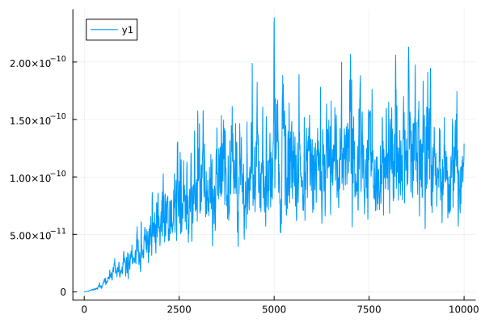

# Shakespeare From Scratch (WIP)
A transformer implementation, in Julia only depending on the standart library.
Also has optional support for GPU, which depends on the CUDA package.

The project is pretty small, coming in at just under 600, at the moment.

```txt
--------------------------------------------------------------------------------
 Language             Files        Lines        Blank      Comment         Code
--------------------------------------------------------------------------------
 Plain Text               1        40000         7223            0        32777
 Julia                    6          718          108           33          577
 Markdown                 1           62           15            0           47
--------------------------------------------------------------------------------
 Total                    8        40780         7346           33        33401
--------------------------------------------------------------------------------
```

## Example mnist classifier

An mnist classifier, using [autodiff.jl](autodiff.jl), to work as a proof-of-concept.
```julia
using MLDatasets

include("autodiff.jl")
include("optimizer.jl")
include("loss.jl")

mnist = MNIST()

g = ADGraph()
w = rand(g, (28 * 28, 10))
b = rand(g, (1, 10))

x = push!(g, reshape(mnist.features[:, :, 1], 1, 28 * 28))
y = push!(g, one_hot((1, mnist.targets[1]), (1, 10)))

ŷ = softmax(x * w + b)

loss = cross_entropy(y, ŷ)
optimizer = Adam(0.001, [w, b], loss)

nval   = 10000
ntrain = 20000

model_accuracy = () -> begin
    correct = 0
    for _ in 1:nval
        i = rand(55001:60000)
        set!(x, reshape(mnist.features[:, :, i], 1, 28 * 28))
        set!(y, one_hot((1, mnist.targets[i]), (1, 10)))
        correct += argmax(val(ŷ)) == argmax(val(y))
    end
    return correct / nval
end

println("Before training: $(100*model_accuracy())%\n")

for i in 0:ntrain
    optimize!(optimizer)
    n = rand(1:55000)
    set!(x, reshape(mnist.features[:, :, n], 1, 28 * 28))
    set!(y, one_hot((1, mnist.targets[n]), (1, 10)))
    println("\u1b[1F$(floor(Int, i*100/ntrain))%")
end

println("After training:  $(100*model_accuracy())%")
```

Outputs:

```txt
# Before training: 10.26%
# 100%
# After training:  74.85000000000001%
```
## One to one comparison with PyTorch
Optimizing a parameter in a linear projection, and testing against values, and initial states, generated with PyTorch (see [test.py](test.py)).



The graph shows the summed squared difference between the expected and actual parameter of the linear projection.
The code used to generate the graph, and do the comparison between the torch and julia parameters, is located at [compare.jl](compare.jl)

## Transformer Validation Spec

Test with basic decoder model, that has no trig mask or positional encoding. Basically just a model that is as simple as possible.

```txt
123#56 = 4
..34#6 = 5
#...56 = 1
1...#. = 5
```
