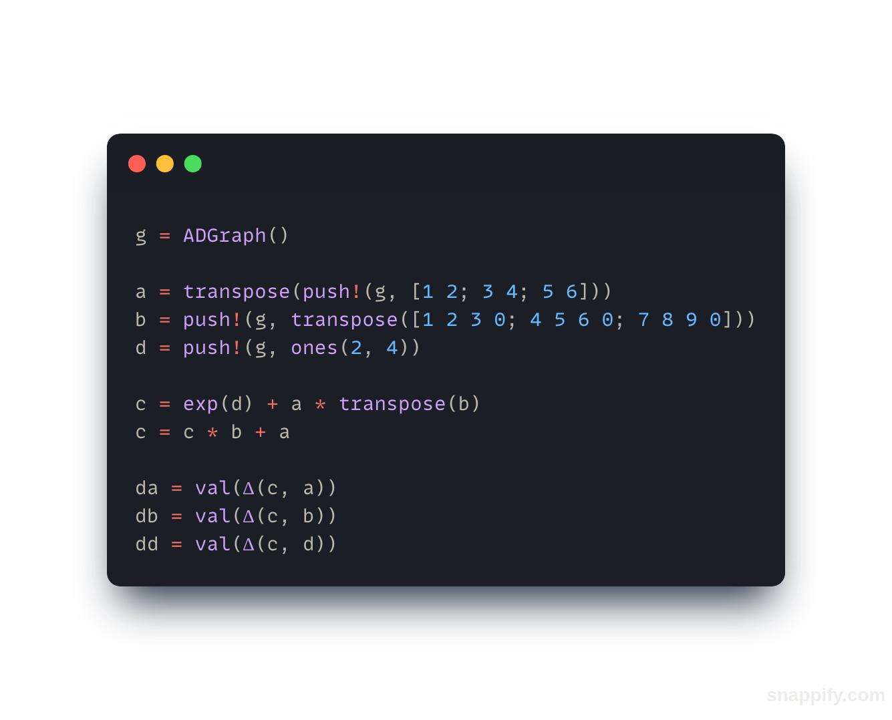

# Shakespear From Scratch (WIP)
A transformer implementation, in Julia only depending on the standart library.
Also has optional support for GPU, which depends on the CUDA package.

## Usage

Screenshot of basic [autodiff.jl](autodiff.jl) usage

