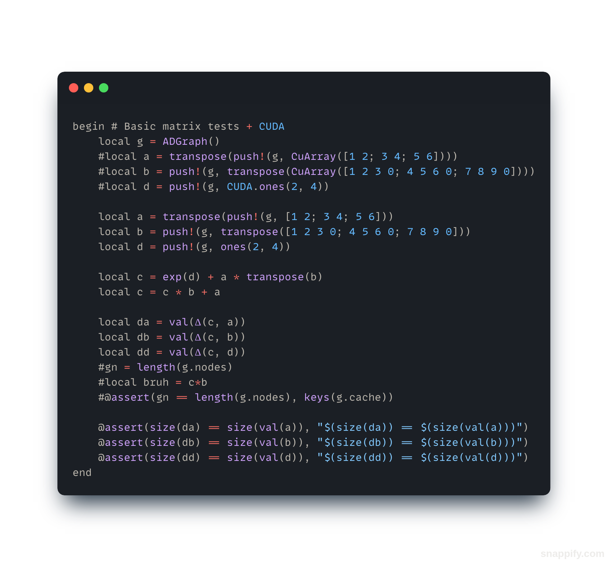

# shakespear_from_scratch
Trying to train/build a transformer, and train it on tiny shakespear, completely from scratch

The repository contains the "attention is all you need" papper, as a pdf, for reference to the implementation.
An attempt to implement the transformer architecture from scratch in rust, and also in julia.
The julia implementation relies on a lightweight autodiff implementation as a backend, while the rust version currently only uses nalgebra
(which is why I started using julia, because this aproach got too complex very fast).

## Usage

Screenshot of basic [autodiff.jl](autodiff.jl) usage

